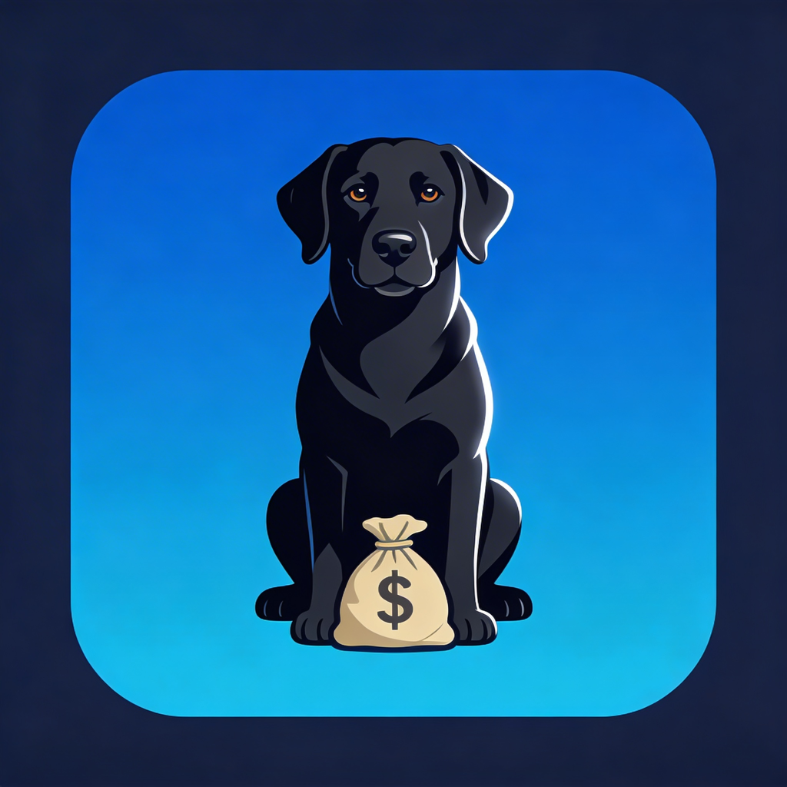
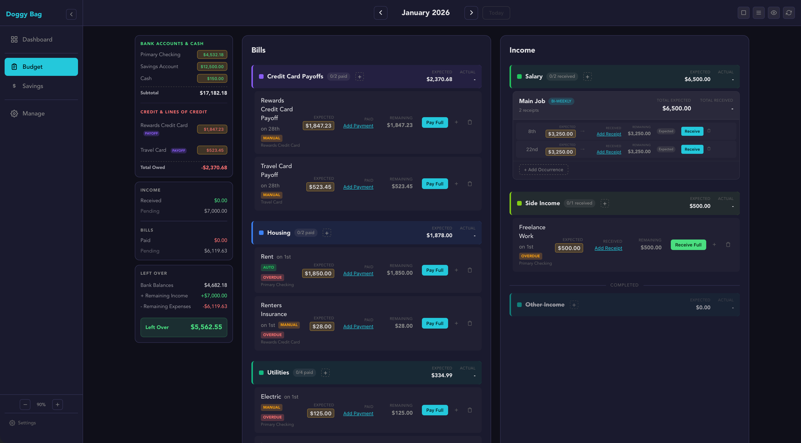

# Doggy Bag

<p align="center">
  
</p>

<p align="center">
  <a href="https://github.com/bradhannah/doggy-bag/releases"></a>
  <a href="https://github.com/bradhannah/doggy-bag/actions/workflows/release.yml"></a>
  <a href="https://github.com/bradhannah/doggy-bag/releases"></a>
  <a href="https://github.com/bradhannah/doggy-bag/stargazers"></a>
  <a href="LICENSE"></a>
</p>

<p align="center">
  
  
  
  
  
  
</p>

_Doggy Bag_ is a desktop budgeting app focused on fixed monthly costs. Answers one question: **"How much do I have left in my doggy bag at the end of month?"**

It promotes active tracking of expenses and income, helping users stay on top of their finances.

---

## What It Does

- Track recurring bills with different billing periods (monthly, bi-weekly, weekly, semi-annual)
- Manage multiple payment sources (bank accounts, credit cards, cash)
- Calculate leftover from actual bank balances + income - expenses
- Month-by-month isolation—each month is its own snapshot

## Features

- Category-organized bill view with colored headers
- Partial payment tracking for bills paid incrementally
- Due dates with overdue indicators
- Ad-hoc expenses for unexpected costs
- Insurance claim tracking with document uploads and reimbursement status
- Configurable data directory (great for cloud sync!)
- Export/import for manual backup

## Sample

_Detailed view of the Budget Details pane showing bills grouped by category with Expected/Actual columns, partial payments, and monthly summary._

<p align="center">
  
</p>

## Installation

**Homebrew (macOS Apple Silicon)**

```bash
brew install bradhannah/doggy-bag/doggy-bag
```

**Download Binary (macOS ARM)**

Grab the latest `.dmg` from [GitHub Releases](https://github.com/bradhannah/doggy-bag/releases).

Windows and Linux builds coming.

**Build from Source**

```bash
make install-prereqs   # Check Rust, Bun, Node
make install-all       # Install dependencies
make build             # Build Tauri app
```

Requires: Rust, Bun 1.x, Node.js (optional)

## Tech Stack

- **Desktop**: Tauri 2.x (Rust)
- **Frontend**: Svelte 5 / SvelteKit
- **Backend**: Bun (compiled sidecar)
- **Language**: TypeScript (strict mode)
- **Data**: Local JSON files
