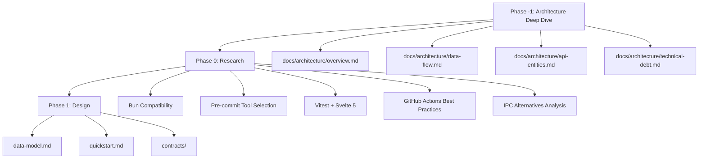

# Implementation Plan: Code Quality & CI/CD

**Branch**: `005-code-quality-cicd` | **Date**: 2026-01-03 | **Spec**: [spec.md](./spec.md)
**Input**: Feature specification from `/specs/005-code-quality-cicd/spec.md`

## Summary

Establish comprehensive code quality infrastructure including linting (ESLint, Prettier, Clippy), testing (Vitest, Bun test, Playwright), coverage enforcement (80% threshold), pre-commit hooks, and GitHub Actions CI/CD. All tooling must run on Bun-only (no Node.js requirement). Includes fixing all existing build warnings and creating lightweight architecture documentation. IPC alternatives research is scoped as analysis only.

## Technical Context

**Language/Version**: TypeScript 5.6.x (strict mode), Rust 2021 edition, Svelte 5.x
**Primary Dependencies**: ESLint 9, Prettier, Vitest, Playwright, Husky/lefthook, GitHub Actions
**Storage**: N/A (tooling/configuration feature, no data storage)
**Testing**: Vitest (frontend), Bun test (backend), Playwright (E2E), cargo test (Rust)
**Target Platform**: macOS ARM64 (primary), cross-platform CI (macOS initially)
**Project Type**: Desktop application (Tauri + Bun backend + Svelte frontend)
**Performance Goals**: Lint <30s, Tests <5min, Pre-commit <60s
**Constraints**: Bun-only (no Node.js), zero build warnings, 80% coverage minimum
**Scale/Scope**: ~150 source files, ~10K LOC, single developer initially

### Research Required

1. **Bun Compatibility**: [NEEDS RESEARCH] Verify ESLint 9, Prettier, Husky work with Bun runtime
2. **Pre-commit Tool**: [NEEDS RESEARCH] Compare Husky vs lefthook vs simple-git-hooks for Bun compatibility
3. **Vitest + Svelte 5**: [NEEDS RESEARCH] Confirm @testing-library/svelte supports Svelte 5
4. **GitHub Actions Bun**: [NEEDS RESEARCH] Best practices for Bun-based CI workflows
5. **IPC Alternatives**: [NEEDS RESEARCH] Tauri commands, Unix sockets, IPC channels feasibility

## Constitution Check

_GATE: Must pass before Phase 0 research. Re-check after Phase 1 design._

| Principle                               | Status | Evidence/Notes                                                                                 |
| --------------------------------------- | ------ | ---------------------------------------------------------------------------------------------- |
| II. Test-First Development              | PASS   | This feature establishes testing infrastructure; will write tests for any utility code created |
| III. Incremental Delivery               | PASS   | 8 user stories prioritized P1-P3, each independently testable                                  |
| IV. Specification Before Implementation | PASS   | Spec complete with 45 FRs, 14 SCs                                                              |
| X. Avoid Silly Libraries                | PASS   | Using standard tools (ESLint, Prettier, Vitest) - no unnecessary dependencies                  |
| XI. Makefiles for Automation            | PASS   | All quality commands via Makefile (make lint, make test, make format)                          |
| XIV. API Documentation                  | N/A    | No new APIs in this feature                                                                    |
| XV. No Containers                       | PASS   | All tooling runs locally, no Docker                                                            |
| XVI. Bun Backend                        | PASS   | Bun test runner for backend, Bun package management throughout                                 |
| XIX. SvelteKit Frontend                 | PASS   | Vitest + testing-library/svelte for component tests                                            |
| XXIII. Styling via Scoped CSS           | N/A    | No styling changes in this feature                                                             |
| XXIV. No External UI Libraries          | N/A    | No UI components in this feature                                                               |
| XXVII. Backend Testing                  | PASS   | Backend tests via Bun test runner with coverage                                                |

**Gate Result**: PASS - All applicable principles satisfied

## Project Structure

### Documentation (this feature)

```text
specs/005-code-quality-cicd/
├── plan.md              # This file
├── research.md          # Phase 0 output (Bun compatibility, tool comparison)
├── data-model.md        # Phase 1 output (minimal - config schemas only)
├── quickstart.md        # Phase 1 output (developer setup guide)
├── contracts/           # Phase 1 output (N/A - no APIs)
└── tasks.md             # Phase 2 output (implementation tasks)
```

### Source Code (repository root)

```text
# Existing structure (unchanged)
src/                     # Svelte frontend
├── components/
├── routes/
├── stores/
└── types/

api/                     # Bun backend
├── src/
│   ├── controllers/
│   ├── models/
│   ├── services/
│   └── utils/
└── tests/               # NEW: Backend tests

src-tauri/               # Rust desktop shell
└── src/

# New additions for this feature
.github/
└── workflows/
    ├── ci.yml           # PR validation workflow
    └── build.yml        # Tauri build workflow

docs/                    # NEW: Architecture documentation
├── architecture/
│   ├── overview.md      # Component diagram
│   ├── data-flow.md     # Request/response flow
│   └── api-entities.md  # High-level API entity docs
└── adr/
    ├── template.md      # ADR template
    └── 001-ipc-research.md  # IPC alternatives decision

# Configuration files (root)
eslint.config.js         # ESLint 9 flat config
.prettierrc              # Prettier config
.prettierignore          # Prettier ignore patterns
vitest.config.ts         # Vitest configuration
playwright.config.ts     # Playwright E2E config
.husky/                  # Pre-commit hooks (or lefthook.yml)
```

**Structure Decision**: Extends existing Tauri + Bun + Svelte structure. New directories: `.github/workflows/`, `docs/`, `api/tests/`. Configuration files at root for tooling.

## Complexity Tracking

> No constitution violations requiring justification.

| Violation | Why Needed | Simpler Alternative Rejected Because |
| --------- | ---------- | ------------------------------------ |
| None      | N/A        | N/A                                  |

## Phase Dependencies



## Phase -1: Interactive Architecture Deep Dive (US-0)

**Status**: IN PROGRESS  
**Purpose**: Comprehensive understanding of existing architecture before implementing quality tooling

This phase is a prerequisite to all other work. It ensures the team has validated understanding of:

- System structure and component relationships
- Code patterns and conventions in use
- Technical debt that needs addressing
- Appropriate linting/testing strategies for the actual codebase

### Review Process

Interactive format: AI presents findings section-by-section, developer validates/corrects before proceeding.

1. **System Overview** - High-level architecture, process model, IPC patterns
2. **Frontend Analysis** - Svelte components, stores, routing, type patterns
3. **Backend Analysis** - Services, API routes, models, validation, error handling
4. **Desktop Shell Analysis** - Rust structure, Tauri plugins, native integrations
5. **Cross-Cutting Concerns** - Shared types, config, logging, security
6. **Technical Debt** - Code smells, inconsistencies, documentation gaps
7. **Tooling Recommendations** - Linting rules, test strategy, coverage focus

### Deliverables

- `docs/architecture/overview.md` - Component diagram and system description
- `docs/architecture/data-flow.md` - Request/response patterns
- `docs/architecture/api-entities.md` - High-level entity documentation
- `docs/architecture/technical-debt.md` - Identified issues and remediation plan
- ADRs for significant findings

## Known Issues to Resolve

These existing issues must be fixed as part of User Story 7 (Zero Build Warnings):

1. `src/components/DetailedView/DetailedMonthView.svelte:8` - Missing `compactMode` export from `stores/ui`
2. `scripts/generate-sample-data.ts` - Missing Bun type definitions (8 errors)

## Next Steps

1. **Phase -1**: Complete Interactive Architecture Deep Dive (US-0) - IN PROGRESS
   - Analyze codebase structure systematically
   - Present findings for developer validation
   - Produce architecture documentation
   - Identify technical debt
2. **Phase 0**: Generate `research.md` with findings on all [NEEDS RESEARCH] items (COMPLETE)
3. **Phase 1**: Generate `data-model.md`, `quickstart.md`, and architecture docs (COMPLETE)
4. **Phase 2**: Run `/speckit.tasks` to generate implementation tasks
